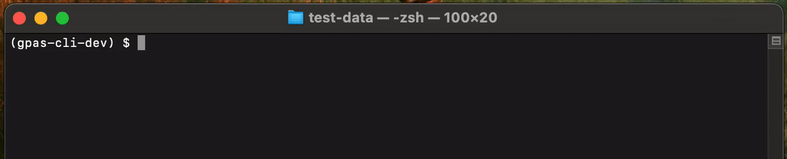
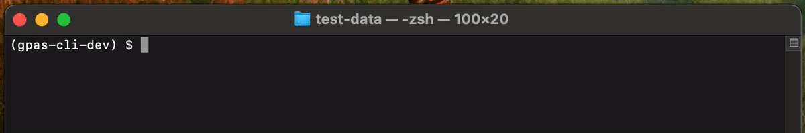

  [](https://badge.fury.io/py/gpas)

The command line client for interacting with the [Global Pathogen Analysis Service](https://www.gpas.cloud/). Works with Ubuntu Linux, MacOS, and Windows via WSL2. The client uses parallelisation and asynchronous requests for fast client-side decontamination and upload, and automatically renames downloaded output files with original sample identifiers for convenience while preserving privacy.



| Command line interface | Python API |
| ----------------- | ------- |
| ✅ `gpas upload` | ✅ `lib.Batch(upload_csv, token).upload()` |
| ✅ `gpas download` | ✅ `lib.download_async()` |
| ✅ `gpas validate` | ✅ `validation.validate()` |
| ✅ `gpas status` | ✅ `lib.fetch_status()`, `lib.fetch_status_async()` |


## Install

####  With `conda` (recommended)

Installation using (Mini)conda is recommended ([Miniconda installation guide](https://conda.io/projects/conda/en/latest/user-guide/install/index.html)). If using a Mac with Apple silicon, follow instructions to [install Miniconda and gpas-cli inside a Rosetta Terminal](https://github.com/GlobalPathogenAnalysisService/gpas-cli/wiki/Installation-for-Macs-with-Apple-silicon).


```shell
# Install inside a new Conda environment
curl https://raw.githubusercontent.com/GlobalPathogenAnalysisService/gpas-cli/main/environment.yml --output environment.yml
conda env create -f environment.yml

# Activate and use
conda activate gpas-cli
gpas --version
```


#### With `pip`

One can alternatively `pip install` the PyPI package in a Python 3.10+ environment, and manually install [`samtools`](http://www.htslib.org/) and [`readItAndKeep`](https://github.com/GlobalPathogenAnalysisService/read-it-and-keep) binary dependencies.

```shell
# Install inside a new Python environment
python3 -m venv gpas-cli
source gpas-cli/bin/activate
pip install gpas

# Activate and use
source gpas-cli/bin/activate
gpas --version

# If samtools and read-it-and-keep are not in $PATH, tell gpas-cli where to find them
export GPAS_SAMTOOLS_PATH=path/to/samtools
export GPAS_READITANDKEEP_PATH=path/to/readItAndKeep
```


#### With a single executable (upload functionality only)

Upload functionality mirroring `gpas upload` is also available as single file Linux, MacOS and Windows executables for each release. These are intended for distribution with the GUI client but may be used independently. These can be downloaded from the 'Artifacts' section of each workflow run listed here: https://github.com/GlobalPathogenAnalysisService/gpas-cli/actions/workflows/distribute.yml


## Authentication

Most `gpas-cli` actions require a valid API token (`token.json`). This can be saved using the 'Get API token' button on the 'Upload Client' page of the GPAS portal. If you can't see this button, please ask the GPAS team to enable it for you. And if you'd like to try GPAS, please get in touch!


## Command line usage

### `gpas validate`

Validates an `upload_csv` and checks that the fastq or bam files it references exist.

```shell
gpas validate large-nanopore-fastq.csv

# Validate supplied tags
gpas validate --environment dev --token token.json large-nanopore-fastq.csv
```

```
% gpas validate -h
usage: gpas validate [-h] [--token TOKEN] [--environment {dev,staging,prod}] [--json-messages] upload_csv

Validate an upload CSV. Validates tags remotely if supplied with an authentication token

positional arguments:
  upload_csv            Path of upload CSV

options:
  -h, --help            show this help message and exit
  --token TOKEN         Path of auth token available from GPAS Portal
                        (default: None)
  --environment {dev,staging,prod}
                        GPAS environment to use
                        (default: prod)
  --json-messages       Emit JSON to stdout
                        (default: False)
```

### `gpas upload`

Validates, decontaminates and upload reads specified in `upload_csv` to the specified GPAS environment


```shell
gpas upload --environment dev --token token.json large-illumina-bam.csv

# Dry run; skip submission
gpas upload --dry-run --environment dev --token token.json large-illumina-bam.csv

# Offline mode; quit after decontamination
gpas upload tests/test-data/large-nanopore-fastq.csv
```

```
% gpas upload -h
usage: gpas upload [-h] [--token TOKEN] [--working-dir WORKING_DIR] [--out-dir OUT_DIR] [--processes PROCESSES] [--dry-run]
                   [--debug] [--environment {dev,staging,prod}] [--json-messages]
                   upload_csv

Validate, decontaminate and upload reads to the GPAS platform

positional arguments:
  upload_csv            Path of upload csv

options:
  -h, --help            show this help message and exit
  --token TOKEN         Path of auth token available from GPAS Portal
                        (default: None)
  --working-dir WORKING_DIR
                        Path of directory in which to make intermediate files
                        (default: /tmp)
  --out-dir OUT_DIR     Path of directory in which to save mapping CSV
                        (default: .)
  --processes PROCESSES
                        Number of tasks to execute in parallel. 0 = auto
                        (default: 0)
  --dry-run             Exit before submitting files
                        (default: False)
  --debug               Emit verbose debug messages
                        (default: False)
  --environment {dev,staging,prod}
                        GPAS environment to use
                        (default: prod)
  --json-messages       Emit JSON to stdout
                        (default: False)
```

### `gpas download`

Downloads `json`, `fasta`, `vcf` and `bam` outputs from the GPAS platform by passing either a `mapping_csv` generated during batch upload, or a comma-separated list of sample guids. By passing both `--mapping-csv` and `--rename`, output files are saved using local sample names without the platform's knowledge.



```shell
# Download and rename BAMs for a previous upload
gpas download --rename --mapping-csv C-a06cbab8.mapping.csv --file-types bam token.json

# Download all outputs for a single guid
gpas download --guids 6e024eb1-432c-4b1b-8f57-3911fe87555f --file-types json,vcf,bam,fasta token.json
```

```
% gpas download -h
usage: gpas download [-h] [--mapping-csv MAPPING_CSV] [--guids GUIDS] [--file-types FILE_TYPES] [--out-dir OUT_DIR] [--rename]
                     [--debug] [--environment {dev,staging,prod}]
                     token

Download analytical outputs from the GPAS platform for given a mapping csv or list of guids

positional arguments:
  token                 Path of auth token (available from GPAS Portal)

options:
  -h, --help            show this help message and exit
  --mapping-csv MAPPING_CSV
                        Path of mapping CSV generated at upload time
                        (default: None)
  --guids GUIDS         Comma-separated list of GPAS sample guids
                        (default: )
  --file-types FILE_TYPES
                        Comma separated list of outputs to download (json,fasta,bam,vcf)
                        (default: fasta)
  --out-dir OUT_DIR     Path of output directory
                        (default: /Users/bede/Research/Git/gpas-cli)
  --rename              Rename outputs using local sample names (requires --mapping-csv)
                        (default: False)
  --debug               Emit verbose debug messages
                        (default: False)
  --environment {dev,staging,prod}
                        GPAS environment to use
                        (default: prod)
```

### `gpas status`

Check the processing status of an uploaded batch by passing either a `mapping_csv` generated at upload time, or a comma-separated list of sample guids.

```shell
gpas status --mapping-csv example_mapping.csv --environment dev token.json
gpas status --guids 6e024eb1-432c-4b1b-8f57-3911fe87555f --format json token.json
```

```
% gpas status -h
usage: gpas status [-h] [--mapping-csv MAPPING_CSV] [--guids GUIDS] [--format {table,csv,json}] [--rename] [--raw]
                   [--environment {dev,staging,prod}]
                   token

Check the status of samples submitted to the GPAS platform

positional arguments:
  token                 Path of auth token available from GPAS Portal

options:
  -h, --help            show this help message and exit
  --mapping-csv MAPPING_CSV
                        Path of mapping CSV generated at upload time
                        (default: None)
  --guids GUIDS         Comma-separated list of GPAS sample guids
                        (default: )
  --format {table,csv,json}
                        Output format
                        (default: table)
  --rename              Use local sample names (requires --mapping-csv)
                        (default: False)
  --raw                 Emit raw response
                        (default: False)
  --environment {dev,staging,prod}
                        GPAS environment to use
                        (default: prod)
```


## Development and testing

Use pre-commit to apply black style at commit time (should happen automatically)

```shell
git clone https://github.com/GlobalPathogenAnalysisService/gpas-cli
conda env create -f environment-dev.yml
conda activate gpas-cli-dev
cd gpas-cli
pip install --upgrade --force-reinstall --editable ./

# Offline unit tests
pytest tests/test_gpas.py

# The full test suite requires a valid token for dev inside tests/test-data
pytest --cov=gpas
```


*Authors: Bede Constantinides and Philip Fowler*
